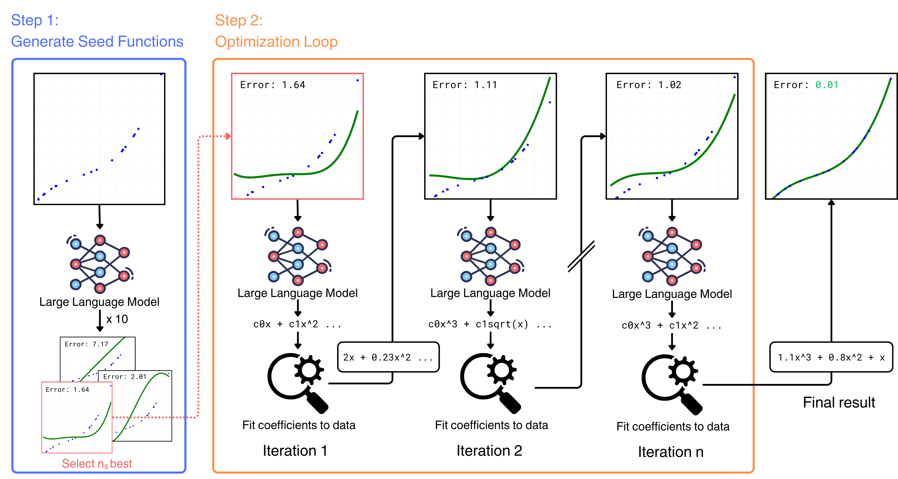
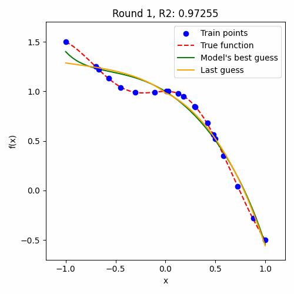

# In-Context Symbolic Regression

<p align="center" style="text-align:center">
  
  <br>
      <em>Overview of the method.</em>
</p>


Official code implementation for the ACL 2024 Student Research Workshop paper [In-Context Symbolic Regression: Leveraging Language Models for Function Discovery](https://aclanthology.org/2024.acl-srw.49/). The proposed approach defines an iterative procedure that refines a functional form with an LLM and determines its coefficients with an external optimizer.

<p align="center" style="text-align:center">
  
  <br>
      <em>Example of the ICSR optimization loop.</em>
</p>

## Setup

This codebase uses Python 3.11.6.

First, clone the repository, then install the required packages.
We recommend using a virtual environment to avoid conflicts with other Python packages:

```bash
python3 -m venv .venv
source .venv/bin/activate
pip install -r requirements.txt
```

## Usage

The method is self-contained in the `main.py` script, configured using [Hydra](https://hydra.cc/) from the `conf/` directory. Before running the method, ensure that the configuration files are set up correctly. Specifically, the `root` path in the `conf/config.yaml` file should be set to the absolute path for the root directory of the repository. If models from the HuggingFace platform are used (for example, Llama3 8B), the `cache_dir` path in the `conf/model/llama3-8b.yaml` (or any other added model) should point to a directory where the models are stored. If models from OpenAI are used (for example, GPT-3.5 or GPT-4o), the `api_key` path in the `conf/model/gpt-3.5.yaml` (or any other model) should be set to the path of the API key.

```bash
python3 main.py
```

This will run the method with the default configuration on the "nguyen1" experiment using Llama3 8B as the language model. Note that this requires a capable GPU. For a quick demo, we suggest using an OpenAI model, like GPT-3.5 (which requires an API key). To run the same experiment with GPT-3.5, use the following command:

```bash
python3 main.py model=gpt3.5-turbo
```

## Configuration

All the configuration files are stored in the `conf/` directory. The values for each parameter in the provided configuration file reflect the ones used for the paper's experiments. The configuration files are organized as follows:

- All experiments are defined in the `conf/experiment/function`, where all four benchmarks are stored. To add a new benchmark, create a new YAML file in the `conf/experiment/function` directory (or in a subdirectory if necessary) following the existing file structure (see `conf/experiment/function/nguyen/nguyen1.yaml` for an example).
- All models are defined in the `conf/model` directory. By default, we include a configuration file for Llama3 8B (using the HuggingFace platform), LLaVa-NeXT, GPT-3.5 and GPT-4o. To add a new model, create a new YAML file in the `conf/model` directory following the existing file structure (see `conf/model/llama3-8b.yaml` for an example using HugoingFace models or `conf/model/gpt-3.5.yaml` for an example using OpenAI models).
- The file `conf/config.yaml` contains general configuration settings, like the torch device and random seed. The `root` path should be set to the absolute path for the root directory of the repository.
- The file `conf/experiment/standard.yaml` contains the default configuration for all experiments independent of the function, like the coefficient optimizer settings.
- The files in the `conf/experiment/function` subdirectories contain the configuration for each individual function. These include the ground truth function and the point range for the function evaluation. For reproducibility, we also provide the exact random points we sampled for the experiments in the `data` directory. By default, all experiments are performed on this set of points and are not re-sampled. The path for each function's data points is defined in the respective function configuration file.
- The files in the `conf/experiment/scorer` directory contain the configuration for the scoring functions used to evaluate the discovered functions.
- The files in the `conf/experiment/seed_functions` directory contain the configuration for the seed functions used to initialize the discovered functions. In the paper we ask the LLM to generate the initial seed functions, but changing this configuration allows for a manually defined set of seed functions.
- The files in the `conf/model/base_prompt` directory contain the configuration for all the prompts used by the models. In practice, the main difference between prompts is the type of images provided for vision models, used in the experiments in the Appendix of the paper.

Using hydra, the configuration can be overridden from the command line. Note that there is a difference in overriding a single parameter (i.e. line) in a file (for example the number of iterations in `conf/experiment/function/nguyen/nguyen1.yaml) and overriding the entire file (used when changing the model or the experiment). The former is done with '.' separators, while the latter is done with '/' separators. For example, to run the "keijzer6" experiment with the GPT-3.5 model, 100 iterations and stop when the $R^2$ score on the training points is higher than 0.95, use the following command:

```bash
python3 main.py experiment/function=keijzer/keijzer6 model=gpt3.5-turbo experiment.function.iterations=100 experiment.function.tolerance=0.95
```

To find the exact name of each parameter, check the respective configuration files.

## Code Structure

The code is organized as follows:

- The main entry point is the `main.py` This defines a Workspace class that loads the configuration files, sets up the points and model and runs the main loop.
- `current_functions.py` contains an helper class to manage the best functions found during the optimization and add them to the context.
- `optimizer.py` contains the optimizer class that is used to optimize the coefficients of the functions.
- `plotter.py` contains the class used to plot the results of the experiments and to give inputs to the visual models.
- The `scorers` directory contains the classes used to evaluate the discovered functions.
- The `models` directory contains the classes used to interact with the language models.

## Citation

If you find this code useful, please consider citing our paper:

```bibtex
@inproceedings{merler-etal-2024-context,
    title = "In-Context Symbolic Regression: Leveraging Large Language Models for Function Discovery",
    author = "Merler, Matteo  and
      Haitsiukevich, Katsiaryna  and
      Dainese, Nicola  and
      Marttinen, Pekka",
    editor = "Fu, Xiyan  and
      Fleisig, Eve",
    booktitle = "Proceedings of the 62nd Annual Meeting of the Association for Computational Linguistics (Volume 4: Student Research Workshop)",
    month = aug,
    year = "2024",
    address = "Bangkok, Thailand",
    publisher = "Association for Computational Linguistics",
    url = "https://aclanthology.org/2024.acl-srw.49",
    pages = "589--606"
}
```
